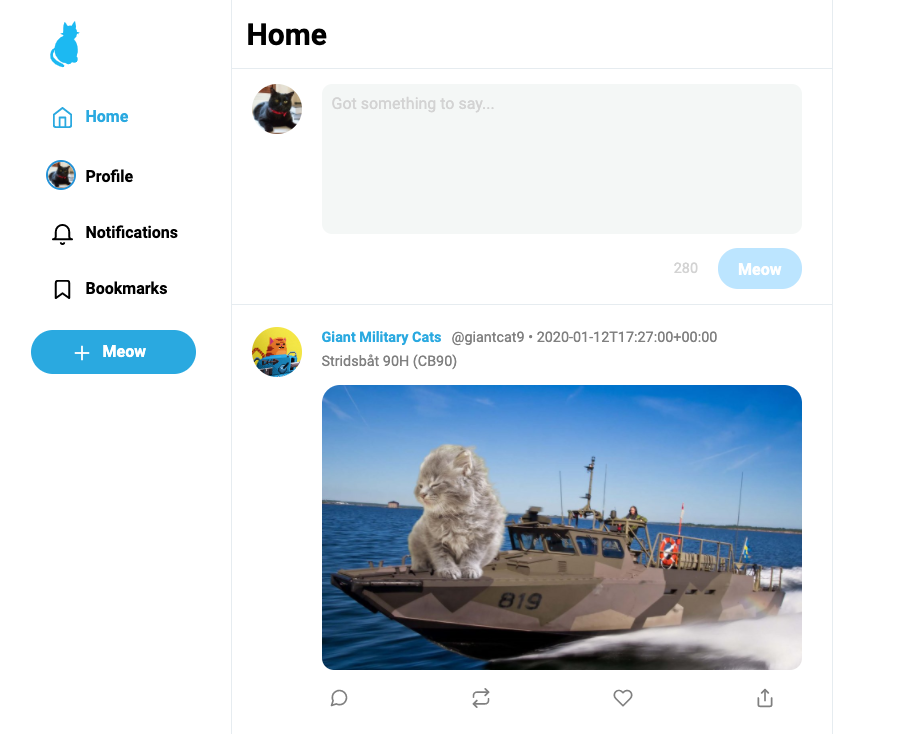
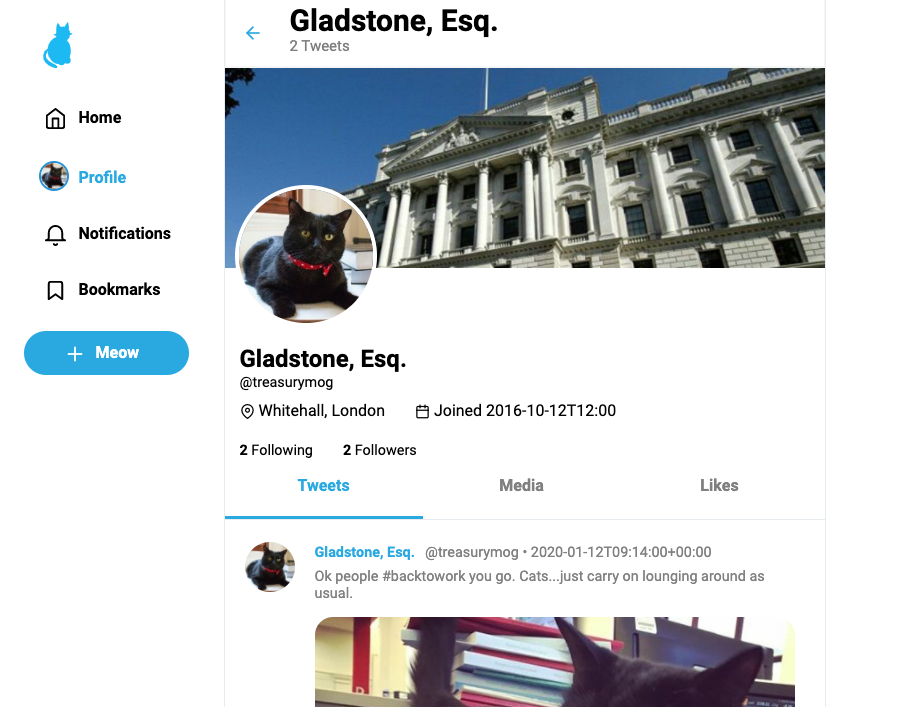
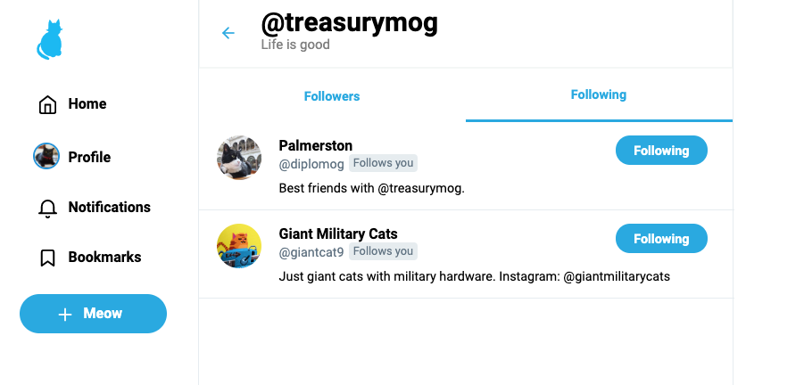

# Twitter Clone project

## Create twitter clone application

### Home page

### Profile page

### Followers page

##### Built with
React/Hooks
Backend: Node.js/Express

### Setup

##### Frontend

This project was bootstrapped with [Create React App](https://github.com/facebook/create-react-app).

##### Available Scripts

In the project directory, you can run:

###### `yarn start`

Runs the app in the development mode. 
Open [http://localhost:3000](http://localhost:3000) to view it in the browser.

The page will reload if you make edits.

You will also see any lint errors in the console.

##### Features

- TweetBox
- Like / Retweet
- Follow / Unfollow

##### Credits

Thanks to @scottanthonymorin
